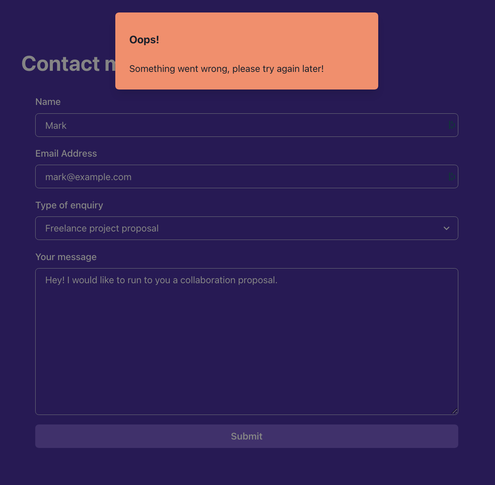
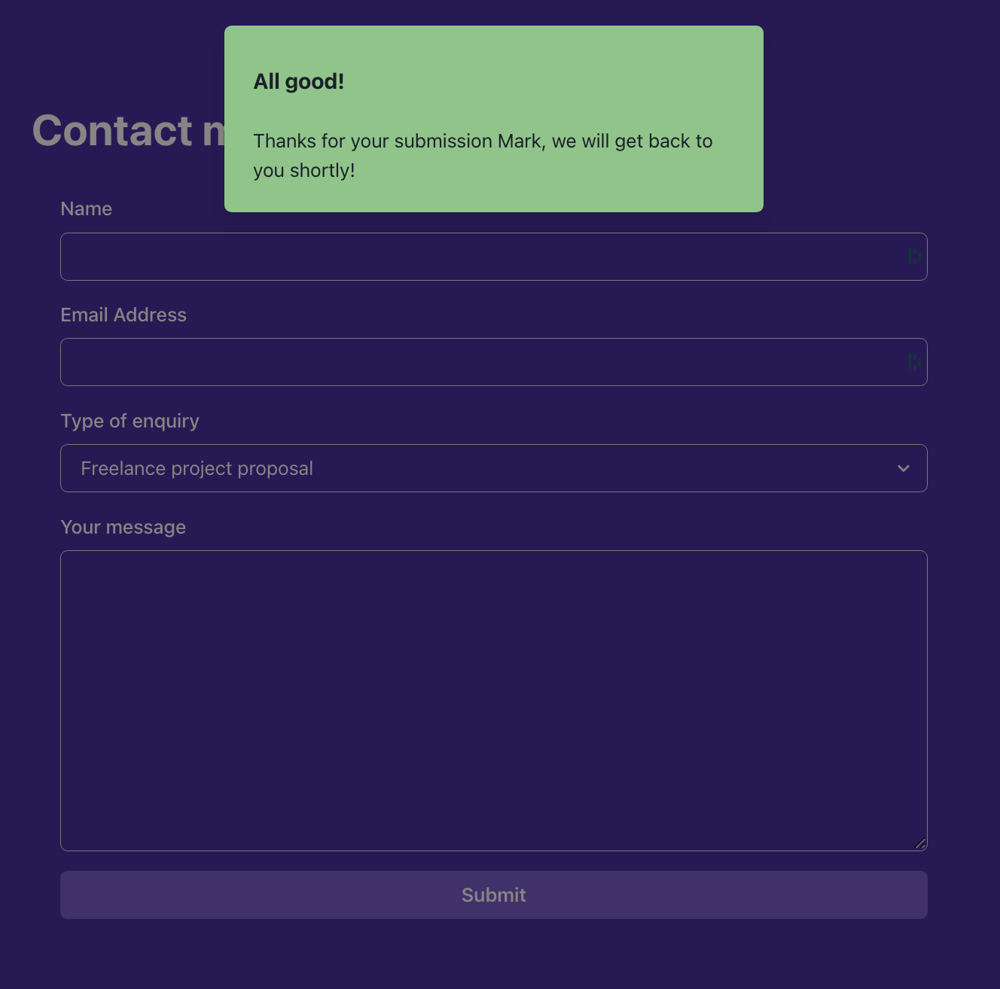

# Instructions

## Task

Di lab akhir ini, Anda akan membuat halaman portofolio untuk Anda sendiri. Anda akan menggunakan keterampilan yang telah Anda pelajari dalam kursus ini untuk membuat halaman yang menampilkan karya Anda.
Halaman portofolio akan menjadi satu halaman yang berisi bagian-bagian berikut:

- Tajuk dengan tautan eksternal ke akun media sosial dan tautan internal ke bagian lain halaman
- Bagian pendaratan dengan gambar avatar dan bio singkat
- Bagian untuk menampilkan proyek unggulan Anda sebagai kartu dengan gaya kisi
- Bagian hubungi saya dengan formulir untuk memungkinkan pengunjung menghubungi Anda

Di sini Anda akan memiliki kesempatan untuk menggunakan beberapa perpustakaan sumber terbuka populer yang akan membantu Anda memiliki halaman yang terlihat lebih rapi dan profesional.

Sebelum melangkah lebih jauh, mari berikan pengantar tentang perpustakaan yang akan Anda gunakan.

### Libraries

#### Chakra UI

Chakra UI hadir dengan pra-konfigurasi dengan lab ini, jadi Anda tidak perlu khawatir untuk menginstal atau menyiapkannya.

Komponen dari pustaka ini yang perlu Anda gunakan sudah diimpor dari paket `@chakra-ui/react` di bagian atas setiap file terkait.
Jika Anda tidak melihat komponen sudah diimpor, itu karena Anda mungkin tidak membutuhkannya.
Apa pun itu, jangan ragu untuk memeriksa [dokumentasi](https://chakra-ui.com/docs/components) resmi mereka untuk melihat semua komponen yang Anda inginkan dan alat peraga yang sesuai.

#### Formik and Yup

Pustaka Formik juga sudah disiapkan di proyek, jadi tidak diperlukan konfigurasi tambahan.
Di lab ini, Anda hanya akan menggunakan hook `useFormik` dari library Formik, serta objek global `Yup` untuk menentukan aturan validasi formulir Hubungi Saya.

Form UI akan diimplementasikan menggunakan komponen Chakra UI.

Sebelum Anda mulai, jika Anda menjalankan `npm start` dan melihat aplikasi di browser, Anda akan melihat bahwa aplikasi React awal berfungsi sebagaimana adanya.

Aplikasi menampilkan halaman dengan header kosong, 3 bagian tinggi penuh yang berbeda, dan footer.
Setiap bagian memiliki warna background yang berbeda. 2 bagian pertama akan kosong dan bagian ketiga akan berisi semua elemen UI untuk formulir Hubungi Saya.

## Steps

Setelah Anda membuka lab kode, Anda perlu menginstal _Chakra UI_ dan pustaka referensi lainnya dengan menjalankan perintah `npm install` dari terminal bawaan di lab kode. Untuk mengaktifkan terminal bawaan, Anda perlu mengklik item menu Lihat, lalu memilih Terminal di dropdown.

Setelah terminal terbuka (terlihat), Anda dapat menjalankan perintah `npm install`. Ini akan menginstal semua dependensi yang hilang yang diperlukan, sehingga Anda dapat mulai mengerjakan tugas tersebut.

### **Step 1**

Open `Header.js` file. You will see a header component with black background, but no content.

a) **Add external social media links to the header on the left side of the page**.

Implementasi harus ditempatkan di dalam elemen `nav` pertama. Data sudah disediakan dalam larik `socials` di bagian atas file.

Gunakan komponen `HStack` untuk menumpuk tautan secara horizontal.
Setiap sosial harus berupa tag `a` dengan atribut `href` yang menunjuk ke halaman media sosial yang sesuai. Tag `a` harus memiliki komponen `FontAwesomeIcon` sebagai anak, yang sudah diimpor untuk Anda.

Komponen `FontAwesomeIcon` memerlukan 2 properti:

- `icon`: Ikon yang akan ditampilkan. Dalam hal ini, Anda harus menggunakan prop `icon` dari objek `social`.
- `size`: Ukuran ikon. Anda dapat menggunakan nilai `2x`.

Anda dapat memeriksa di bawah ini contoh cara merendernya:

`<FontAwesomeIcon icon="fab" size="2x" />`

b) **Add internal links to the Projects section and Contact Me section**

Setiap tautan harus berupa tag `a`. Setiap tag `a` harus memiliki nama turunan dari bagian: "Hubungi Saya" dan "Proyek".
Saat mengklik tautan, url akan menampilkan bagian yang sesuai. Misalnya, saat mengeklik tautan "Hubungi Saya", jalur urlnya harus `/#contact-me`.
Juga, klik harus menggulir ke bagian yang sesuai dengan animasi yang halus. Kode untuk itu telah disediakan untuk Anda melalui fungsi `handleClick`. Anda perlu menghubungkan fungsi itu dengan event `a` tag `onClick`.
Ingatlah bahwa bagian Proyek memiliki id yang disebut `projects-section` dan bagian Hubungi Saya memiliki id yang disebut `contactme-section`.

Hindari peringatan terkait kunci apa pun saat membuka konsol.

UI tajuk terakhir akan terlihat seperti di bawah ini:

### **Step 2**

Buka file `LandingSection.js`. Terapkan UI di bawah untuk menyediakan bagian pendaratan untuk aplikasi dengan avatar, salam, dan deskripsi peran singkat.
Untuk data, gunakan variabel yang disediakan di bagian atas file (`greeting`, `bio1` dan `bio2`) dan bukan data pribadi.
Untuk avatar bisa menggunakan url selanjutnya: `https://i.pravatar.cc/150?img=7`
Semua komponen yang Anda butuhkan sudah diimpor untuk Anda.

### **Step 3**

Buka komponen `ProjectsSection.js`. Komponen ini sudah diimplementasikan, namun komponen `Kartu` yang digunakannya untuk menampilkan informasi tentang setiap proyek tidak.
Komponen `ProjectsSection` sudah mendefinisikan larik `projects` dengan data untuk setiap proyek dan informasi tersebut diteruskan ke setiap komponen `Card` sebagai props.

Buka komponen `Card.js` dan implementasikan UI untuk kartu tersebut. Setiap kartu akan terlihat seperti gambar di bawah ini:

You can use the following components from Chakra UI that have been already imported for you:

- HStack,
- VStack,
- Image,
- Heading,
- Text,

Untuk panah kanan, gunakan komponen di bawah ini. Impor yang diperlukan juga sudah disediakan untuk Anda.
`<FontAwesomeIcon icon={faArrowRight} size="1x" />`

Avoid any key related warnings when opening the console.

### **Step 4**

Buka komponen `ContactMeSection.js`. Terapkan persyaratan formulir yang tersisa sesuai dengan spesifikasi di bawah ini.

Formulir berisi 4 kolom input: nama, alamat email, jenis pertanyaan dan pesan.

Seluruh UI formulir ditentukan untuk Anda. Anda perlu menerapkan beberapa logika bisnis yang hilang.

a) **Add the proper configuration to the `useFormik` hook, passing an object with 3 properties**: `initialValues`, `onSubmit` and `validationSchema`.

Objek `initialValues` harus memiliki kolom berikut:

- `firstName`: Nama pengguna
- `email`: Email pengguna
- `type`: 'hireMe' | 'sumber terbuka' | 'lainnya'
- `komentar`: Pesan dari pengguna

Fungsi `onSubmit` harus melakukan panggilan API dengan menggunakan bantuan `useSubmit` dari hook `useSubmit`.
Periksa pengait khusus `useSubmit` untuk melihat argumen yang diharapkan oleh fungsi `useSubmit`.

`validationSchema` harus berupa skema Yup yang memvalidasi bidang formulir. Aturan validasi adalah sebagai berikut:

- `firstName`: kolom wajib diisi. Jika tidak, pesan kesalahan harus "Diperlukan".
- `email`: kolom wajib diisi dan email yang valid. Jika kosong, pesan kesalahan harus "Diperlukan". Jika bukan email yang valid, pesan kesalahannya adalah "Alamat email tidak valid".
- `type`: Kolom opsional
- `komentar`: kolom wajib diisi dan dengan minimal 25 karakter. Jika kosong, pesan kesalahan harus "Diperlukan". Jika kurang dari 25 karakter, pesan error harus "Harus minimal 25 karakter".
  b) **Make the `Input` components from Chakra UI controlled components**.

`useFormik` hook mengembalikan objek dengan fungsi yang disebut `getFieldProps` yang ketika dipanggil, mengembalikan objek dengan properti yang diperlukan untuk membuat input dikontrol.

c) **Show the error messages for each field when the field is touched and the validation fails**.

Setiap bidang dikelompokkan dalam komponen `FormControl`. Komponen `FormControl` menggunakan prop `isInvalid` yang dapat Anda gunakan untuk menampilkan pesan kesalahan.

Prop `isInvalid` harus `true` saat bidang disentuh dan validasi gagal.

Komponen `FormErrorMessage` dari Chakra UI harus menampilkan pesan kesalahan yang sesuai jika prop `isInvalid` dari komponen induk `FormControl` benar.

Di bawah ini adalah contoh tampilan UI saat validasi gagal untuk kolom `firstName`:

d) **Connect the `form` onSubmit prop with Formik's `handleSubmit` function.**

Pastikan perilaku formulir HTML default dicegah saat pengiriman terjadi.

e) **Show an alert when the form is submitted successfully**.

Anda perlu mendengarkan perubahan pada objek `response` dari hook `useSubmit`. Selain itu, saat formulir dikirimkan, indikator pemuatan harus ditampilkan di tombol Kirim. Anda dapat menggunakan properti `isLoading` dari hook `useSubmit`.

Kait `useSubmit` diimplementasikan sedemikian rupa sehingga 50% dari waktu itu akan mengembalikan respons yang berhasil dan 50% dari waktu itu akan mengembalikan respons kesalahan.

Objek `response` dari API memiliki 2 properti:

- `type`: 'sukses' | 'kesalahan'
- `message`: Informasi kontekstual ekstra tentang respons

Anda dapat menggunakan hook `useAlertContext` yang disediakan untuk menampilkan peringatan. Pengait mengembalikan fungsi bernama `onOpen` yang dapat Anda panggil untuk menampilkannya.

Periksa file `alertContext.js` untuk melihat argumen yang diharapkan oleh fungsi `onOpen`.

Jika respons berhasil, lansiran harus menampilkan nama depan pengguna di kontennya, sesuai dengan nilai yang diketik di kolom formulir 1, jadi pastikan Anda meneruskan argumen yang benar ke fungsi `kirim` yang dikembalikan dari ` useSubmit` kait.

Selain itu, form harus direset jika respon berhasil. Untuk itu gunakan fungsi `resetForm` dari objek yang dikembalikan dari hook `useFormik`.

Beginilah tampilan UI untuk kedua kasus:

### **Step 5 (bonus)**

Menerapkan animasi tajuk/sembunyikan tergantung pada arah gulir.
Header harus meluncur ke atas dengan beberapa animasi dan disembunyikan saat menggulir ke bawah halaman.
Saat menggulir ke atas, tajuk harus meluncur ke bawah dan terlihat.

Untuk itu, komponen Kotak terluar memiliki beberapa properti transisi yang sudah ditentukan. Logika Anda harus mengubah properti `transform` dari elemen DOM `Box` yang mendasarinya bergantung pada arah scroll.

Saat menggulir ke atas, properti gaya `transform` dari elemen DOM `Box` harus berupa `translateY(0)`.
Saat menggulir ke bawah, properti gaya `transform` dari elemen DOM `Box` harus berupa `translateY(-200px)`.

Berikut adalah beberapa elemen yang mungkin Anda perlukan untuk implementasi:

- Pengait `useEffect`
- Pengait `useRef`
- Menyiapkan pendengar untuk acara gulir `window.addEventListener('scroll', handleScroll)`
- Menghapus pendengar untuk acara gulir: `window.removeEventListener('scroll', handleScroll)`
- Melacak posisi gulir sebelumnya dalam variabel
  
